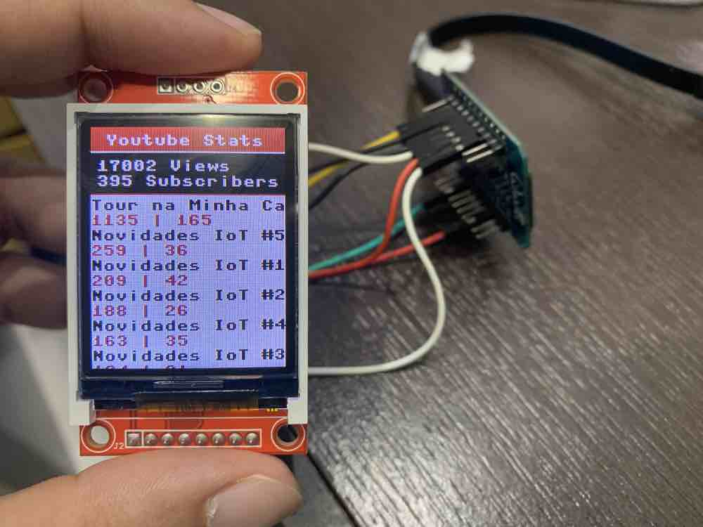

# Youtube TFT Display Board

Fetch data from an Youtube channel using Google API's. For ease of usage and development I decided to use MicroPython running on an ESP32 Wifi board. The TFT Display used was one based on ST7735R driver, but this can easily be ported to other by just using different drivers available [here](https://github.com/adafruit/micropython-adafruit-rgb-display).



## Setup and install micropython on ESP32

#### Install tools and download micropython binary
```
$ pip3 install adafruit-ampy
$ pip3 install esptool
$ curl -o esp32.bin http://micropython.org/resources/firmware/esp32-20190125-v1.10.bin
```
#### For interactive development (Optional)
```
$ git clone https://github.com/goatchurchprime/jupyter_micropython_kernel.git
$ pip3 install jupyter
$ pip3 install -e jupyter_micropython_kernel
$ python3 -m jupyter_micropython_kernel.install
$ jupyter kernelspec list
```
#### Find serial port
```
$ ls /dev/tty.*
# In my case was /dev/tty.SLAB_USBtoUART
```
#### Clean flash and send micropython binary
```  
$ esptool.py --port /dev/tty.SLAB_USBtoUART erase_flash
$ esptool.py --chip esp32 --port /dev/tty.SLAB_USBtoUART --baud 460800 write_flash -z 0x1000 esp32.bin
```

#### Install TFT lib
```
$ curl -o st7735.py https://raw.githubusercontent.com/adafruit/micropython-adafruit-rgb-display/master/st7735.py
$ curl -o rgb.py https://raw.githubusercontent.com/adafruit/micropython-adafruit-rgb-display/master/rgb.py  
$ ampy --port /dev/tty.SLAB_USBtoUART put rgb.py
$ ampy --port /dev/tty.SLAB_USBtoUART put st7735.py
```

#### Install project code

Fill the `config.py` file with you settings for Youtube API, Channel and Wifi connection.

```
$ ampy --port /dev/tty.SLAB_USBtoUART put config.py
$ ampy --port /dev/tty.SLAB_USBtoUART put main.py /main.py
```